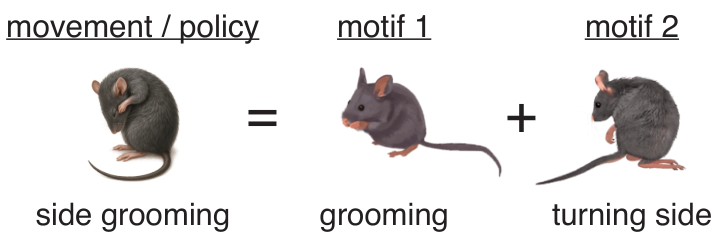
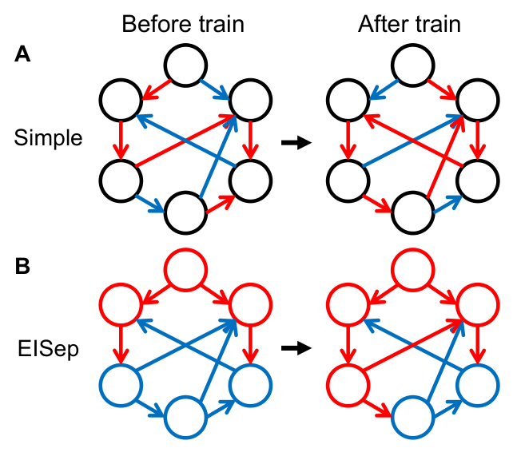
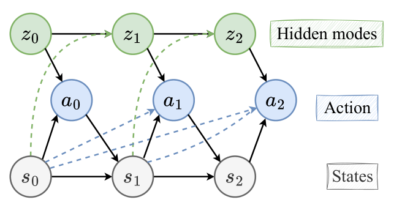

# Website content — editable review copy

This document collects the website copy for review. The homepage has been simplified to a bio, two robot videos, selected publications, and one contact line. Your bio edits naming both Dr. Anqi Wu and Dr. Ye Zhao and your previous work on brain-inspired AI are preserved.

This is a review copy, not a Hugo source file: edits here do not automatically update the website. Edit the source files below directly, or revise this document and ask me to apply the changes.

## Where to make direct edits

| Content | Source file |
| --- | --- |
| Homepage bio, research description, headings, contact, and video details | [Homepage content](content/_index.md) |
| Homepage structure | [Homepage template](layouts/landing/research-home.html) |
| Education, experience, skills, and separate author biography | [Profile data](content/authors/admin/_index.md) |
| Paper titles, authors, summaries, and full descriptions | Each paper's `content/publication/<paper>/index.md` (linked below) |
| Experience page sections and awards | [Experience page](content/experience.md) |
| Navigation labels and destinations | [Navigation](config/_default/menus.yaml) |
| Colors, typography, spacing, and responsive layout | [Styles](assets/css/custom.css) |
| Downloadable CV | Replace `static/uploads/resume.pdf` |

For routine homepage text edits, use `content/_index.md`:

- `introduction.bio`: your biography. Markdown such as `**bold**` is supported.
- `research.title` and `research.description`: the heading and paragraph above the videos.
- `robot_demos`: video titles, captions, durations, and file paths.
- `publications_heading`: the selected-publications heading.
- `contact.text` and `contact.email`: the closing line and email address.

Keep YAML indentation intact. The `|` after `bio:` allows multiple paragraphs, each indented beneath it. Updating the separate author profile will not change this homepage bio.

Publication titles, authors, and venues on the homepage come from their individual paper files. The homepage shows compact citations; summaries and research explanations remain in the archive and detail pages. `weight` controls the order, with smaller values first. `featured: true` includes a paper on the homepage. The publication archive lists all published paper pages regardless of this setting.

With Hugo Extended 0.136.5 and Go installed, run `hugo server` to preview. The GitHub Pages workflow publishes changes pushed to `main`.

# Current homepage copy

## Navigation

About · Robot demos · Publications · Experience · CV ↗

## Introduction

Georgia Tech · PhD Student

**Jiyi Wang.**

I work on **robot learning and embodied AI**: adapting vision-language-action models with human feedback, discovering reusable motor skills, and building more reliable learning systems.

At Georgia Tech, I work with **Dr. Anqi Wu** and **Dr. Ye Zhao** on dexterous manipulation. My research bridges real-world robotic control and reinforcement learning. Previously, I was working on brain-inspired AI.

Links: Download CV ↗ · Email ↗ · Google Scholar ↗ · GitHub ↗

## Robot learning

I fine-tune vision-language-action policies with human-in-the-loop reinforcement learning for precise robotic manipulation. Iterative hardware RL improved millimeter-level task success from **10% to 85%**.

### Continuous pipette alignment — 17 sec

A real-robot demonstration of repeated pipette alignment over a tip rack.

[Open video](static/videos/rl-continuous-align.mp4)

### Responding to perturbations — 8 sec

Pipette alignment while a person moves the tip rack during execution.

[Open video](static/videos/rl-perturbation.mp4)

## Selected publications

### Learning Reusable Motor Motifs for Continuous Animal Behavior Modeling

NeurIPS 2026

**Jiyi Wang**, Jingyang Ke, Bo Dai, Anqi Wu

### Leveraging Dale’s Principle as an Inductive Bias in Recurrent Neural Networks

NeurIPS 2026

**Jiyi Wang**, Chenxiao Yang, Yujia Zhao, Jingzhao Zhang, Lu Mi

### Inverse Reinforcement Learning with Switching Rewards and History Dependency for Characterizing Animal Behaviors

ICML 2025

Jingyang Ke, Feiyang Wu, **Jiyi Wang**, Jeffrey Markowitz, Anqi Wu

Link: All publications →

## Contact

Seeking 2027 research internships in robot learning and embodied AI. [jwang3617@gatech.edu](mailto:jwang3617@gatech.edu)

## Shared footer

© 2026 Jiyi Wang

Published with Hugo Blox Builder — the free, open source website builder that empowers creators.

# Current Experience page

Source: [Profile data](content/authors/admin/_index.md) and [Experience page](content/experience.md).

## Research experience

### Research Assistant · Human-in-the-Loop VLA Learning

Georgia Institute of Technology · 2026-05 – Present

Supervised by Dr. Ye Zhao. Develop learning and control pipelines for dexterous clinical robotic manipulation, including high-precision pipetting.

- Fine-tune GR00T, QwenOFT, and π0.5 policies with supervised fine-tuning and online actor–critic reinforcement learning with human intervention.
- Improved real-robot millimeter-level task success from **10% to 85%** through iterative hardware reinforcement learning.

### Research Assistant · E/I-Separated Recurrent Neural Networks

Shanghai Qizhi Institute · 2025-07 – 2026-05

Supervised by Dr. Lu Mi. Investigated Dale's principle as an inductive bias for recurrent networks, with experiments in multi-task learning, continual learning, and reinforcement learning.

First-author paper accepted to **NeurIPS 2026**.

### Research Assistant · Inverse Reinforcement Learning

BRAINML Lab, Georgia Institute of Technology · 2024-08 – 2025-06

Supervised by Dr. Anqi Wu. Developed a framework to discover reusable motor motifs and recover reward structure from behavioral trajectories. Applied expectation–maximization to multi-reward MDPs to infer latent behavioral intentions.

First-author work on reusable motor motifs accepted to **NeurIPS 2026**; co-authored **ICML 2025** work on switching, history-dependent rewards.

### Research Assistant · Reinforcement Learning Models of Replay

Tsinghua University & New York University · 2023-05 – 2025-07

Supervised by Dr. Sen Song and Dr. Marcelo Mattar. Built a modular reinforcement learning model in JAX to study replay, planning, and cognitive-map learning. Analyzed neural manifolds and reproduced biological replay experiments.

## Education

- **Georgia Institute of Technology** — PhD in Computer Science and Engineering. 2026-05 – Present. GPA: 4.0/4.0
- **Peking University** — BS in Chemistry. 2020-09 – 2024-07. GPA: 3.70/4.00

## Skills

### Learning & Control

- VLA fine-tuning, imitation learning & behavior cloning
- Actor–critic RL, human-in-the-loop RL & inverse RL
- Dexterous manipulation, humanoid control & world models

### Engineering

- Python, PyTorch, JAX, C & C++
- NVIDIA GR00T, QwenOFT, π0.5 & StarVLA
- Isaac Sim / PhysX, MuJoCo & Unitree G1
- Codex & Claude CLI for research development

## Selected Awards

**National Scholarship** (2/165) · **Samsung Scholarship** (20/160) · **National Chemistry Olympiad Silver Medal**

# Author profile biography

Source: [Author profile](content/authors/admin/_index.md). This is separate from the custom homepage introduction.

I am a PhD student at **Georgia Tech**, working on **robot learning and embodied AI**. My research connects learning from behavioral data with learning through interaction: discovering reusable motor skills, adapting vision-language-action policies, and improving real-world control with human feedback.

I currently work with **Dr. Ye Zhao** on human-in-the-loop VLA learning for dexterous manipulation. Previously, I studied inverse reinforcement learning with Dr. Anqi Wu, brain-inspired recurrent networks with Dr. Lu Mi, and reinforcement learning models of replay with Dr. Sen Song and Dr. Marcelo Mattar. I received my BS in Chemistry from **Peking University**.

# Publication archive and detail pages

The archive contains three conference papers. Their individual pages share a teaser figure followed by an overview, method, experimental findings, and research connection. The homepage retains compact publication entries.

To edit a figure, update the `teaser.image`, `teaser.alt`, and `teaser.caption` fields in that paper's source file. Image files live alongside the paper's `index.md`. The figures below are extracted from Figure 1 of each supplied manuscript.

## Learning Reusable Motor Motifs for Continuous Animal Behavior Modeling

Source: [Edit this paper](content/publication/wang-2026-motor-motifs/index.md)

Venue: NeurIPS 2026 · Accepted

Authors: **Jiyi Wang**, Jingyang Ke, Bo Dai, Anqi Wu

Summary: Discovering reusable motor motifs from offline behavior data and composing them into continuous, interpretable policies.

Public PDF and code links: not yet added.

Figure 1: complex behaviors emerge from combinations of reusable motor motifs.

### Learning the building blocks of behavior

Complex movements often combine simpler components: an animal can turn while grooming, or sniff while moving forward. **Motif-based Continuous Dynamics (MCD)** learns these reusable motor motifs directly from behavioral trajectories and models behavior as smoothly changing combinations of them.

### Method

- **Learn from offline trajectories.** Use transition-based spectral representation learning to discover a shared basis for dynamics, policies, and rewards.
- **Compose skills continuously.** Represent behavior through time-varying motif weights, allowing multiple motifs to be active together.
- **Infer policies and reward structure.** Connect the learned representation to maximum-entropy policies and inverse reinforcement learning.

### Experimental findings

Evaluated on simulated gridworlds, maze navigation, and real animal behavior data. On the animal behavior benchmark, MCD outperforms Keypoint-MoSeq, SemiSeg, and OPAL in human-annotated behavior decoding accuracy and trajectory discrimination AUC. The learned motifs capture both transitions and simultaneous movements, such as locomotion and sniffing.

### Research connection

This work studies how reusable, compositional skills can be extracted from observed behavior. It informs my broader interest in learning embodied skills from demonstrations. The experiments in this paper concern simulated tasks and animal behavior; transferring this approach to human motion and robots is a future research direction.

## Leveraging Dale’s Principle as an Inductive Bias in Recurrent Neural Networks

Source: [Edit this paper](content/publication/wang-2026-dales-principle/index.md)

Venue: NeurIPS 2026 · Accepted

Authors: **Jiyi Wang**, Chenxiao Yang, Yujia Zhao, Jingzhao Zhang, Lu Mi

Summary: Learnable excitatory–inhibitory separation improves recurrent learning stability, continual learning, and reinforcement learning control.

Public PDF and code links: not yet added.

Figure 1: EISep learns excitatory–inhibitory neuron identities while preserving Dale’s principle.

### A biological principle for more stable learning

Biological neurons send either excitatory or inhibitory outputs. **EISep RNN** incorporates this constraint, known as Dale’s principle, into recurrent networks while allowing each neuron’s excitatory or inhibitory identity to be learned.

### Method

The architecture combines a learnable sign assignment using Gumbel–Softmax. These choices let the network adapt its excitatory–inhibitory organization during training while improving optimization stability.

### Experimental findings

- **Multi-task learning:** competitive performance on a 20-task cognitive benchmark, with more stable gradients and recurrent dynamics.
- **Continual learning:** reduced task interference and stronger resistance to catastrophic forgetting across sequential cognitive tasks.
- **Reinforcement learning:** improved recurrent advantage actor–critic performance on Lunar Lander and HalfCheetah, covering discrete and continuous control.
- **Interpretable structure:** sparse, modular connectivity emerges from the excitatory–inhibitory constraint.

### Research connection

Reliable policy learning depends on stable optimization and representations that can be reused across tasks. This work explores architectural inductive biases for those properties.

## Inverse Reinforcement Learning with Switching Rewards and History Dependency for Characterizing Animal Behaviors

Source: [Edit this paper](content/publication/ke-2025-inverse/index.md)

Venue: Proceedings of the 42nd International Conference on Machine Learning (ICML), 2025

Authors: Jingyang Ke, Feiyang Wu, **Jiyi Wang**, Jeffrey Markowitz, Anqi Wu

Summary: Recovering time-varying, history-dependent rewards from long behavioral trajectories with switching inverse reinforcement learning.

Public links: [PDF](content/publication/ke-2025-inverse/paper.pdf) · [Code](https://github.com/BRAINML-GT/SWIRL) · [Proceedings](https://proceedings.mlr.press/v267/ke25b.html)

Figure 1: SWIRL models changing goals and history-dependent actions.

### Inferring the intentions behind behavior

**SWIRL (Switching Inverse Reinforcement Learning)** infers changing goals from behavioral trajectories. It models long sequences as transitions between hidden decision-making modes, each with its own reward function and policy.

### Method

- **Goal switching:** transitions between hidden modes depend on the previous mode and the animal’s current state.
- **Behavioral memory:** rewards and policies can depend on recent states, capturing how past experience shapes actions.
- **Joint inference:** expectation–maximization alternates between inferring behavioral modes and learning their transitions, rewards, and policies.

### Experimental findings

- **Gridworld:** combining both levels of history dependence improves reward recovery and behavioral segmentation.
- **Mouse navigation:** recovers interpretable water-seeking, home-seeking, and exploration modes in a 127-node labyrinth.
- **Spontaneous behavior:** outperforms autoregressive HMM baselines in held-out likelihood. State-dependent switching helps, while adding action-level history does not improve this dataset.

### Research connection

This work connects learning from demonstrations with interpretable reward inference, offering a way to study changing intentions and the role of memory in behavior.

Each detail page also includes an email contact link.
